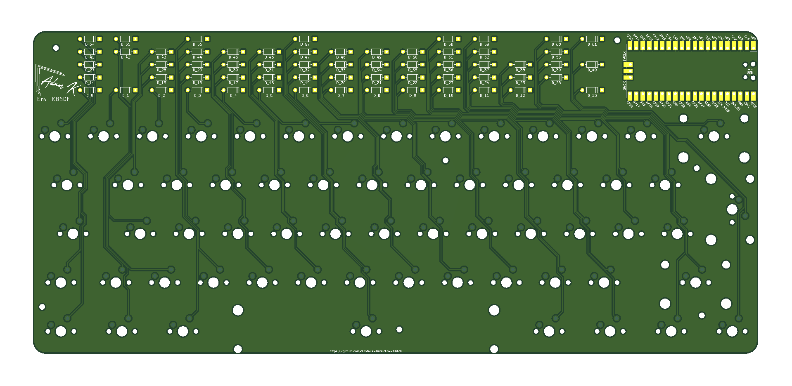

# Env-KB60F
 Another Custom Mechanical Keyboard... F stands for FOREHEAD!

 Project Name: KB60F
 Nickname: Terminus

### About!
This is a simple-ish 60% design using a Raspberry Pi Pico. Its a standard 60% layout supporting ANSI and ISO.
Optionally if you have your own PCBs made you can use some pogo pins with a 1mm post to connect the TP pads on the underside of a raspberry pi pico, This will allow functionality of the USB type-c port if populated.

alternatively if you pick up the RP2040 version there is onboard USB and spare GPIOs so you can wire up what ever else you wish.

### DETAILS
So update as of 30th of August 2021

Im typing this on the first batch of PCBs ive ordered and ive made the KMK Keymap for this keyboard, for the boards I ordered I chose to not have USB installed to keep the cost down.

