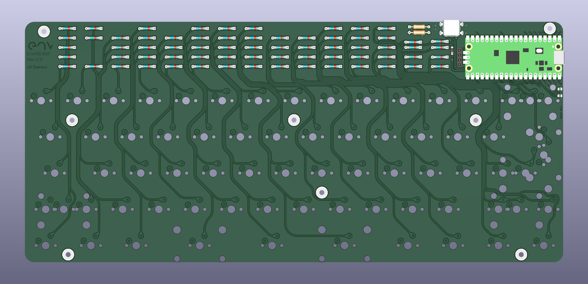

# Env-KB60F
 Another Custom Mechanical Keyboard... F stands for FOREHEAD!

 Project Name: KB60F
 Nickname: Lil Delirium

### About!
This is a simple-ish 60% design using a Raspberry Pi Pico. Its a standard 60% layout supporting ANSI and ISO.
Optionally if you have your own PCBs made you can use some pogo pins with a 1mm post to connect the TP pads on the underside of a raspberry pi pico, This will allow functionality of the USB type-c port if populated.

there are some spare GPIOs and a space for a header (mainly for a small oled) so feel free to add things if you can, I always enjoy seeing people using my keyboards for things I never thought of or intended.

### DETAILS
This keyboard has been merged into QMK so you can either compile it from the QMK code or download the pre-built firmware
https://github.com/qmk/qmk_firmware/tree/master/keyboards/enviousdesign/60f

https://github.com/Envious-Data/EnvKB-QMK/tree/main/_PREBUILTFIRMWARES

